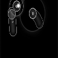
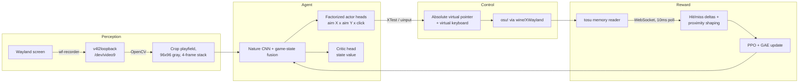

# osu-VisionRL

**A deep reinforcement learning agent that learns to play [osu!](https://osu.ppy.sh/) from raw screen pixels and live game telemetry — no human demonstrations, no supervised pre-training, running against the live, unmodified game in real time on Linux/Wayland.**


<p align="center">
  
  <br>
  <em>What the agent sees — a 96×96 grayscale crop of the playfield, HUD masked out.</em>
</p>

---

## Why this project is interesting

Most game-playing RL research runs inside emulators that can be paused, accelerated, and reset programmatically. This project does none of that. The agent plays the **real osu! client** (under wine) the way a human does:

- **Vision:** it reads the screen through a virtual camera — no memory hooks for observations, no game modifications.
- **Action:** it moves a real (virtual) cursor and presses real (virtual) keys at the OS level.
- **Time:** the game runs at 1× speed and never waits. Every millisecond spent on inference is a millisecond the cursor isn't moving.
- **Learning signal:** pure RL. The reward comes from live gameplay telemetry — there is no dataset of human plays anywhere in the loop.

That combination — real-time, closed-loop control of an unmodified rhythm game from pixels — is the hard version of the problem, and most of the engineering in this repo exists to make it tractable.

## Results so far

**~5.8M environment steps across 1,050+ live episodes**, trained in staged curricula on a 4-map pool (1–2★, CS ≤ 3.5, AR ≤ 4):

| Phase | What it trains | Status | Outcome |
|---|---|---|---|
| **1a — Aim** (Relax mod: game auto-clicks) | Cursor control only | ✅ complete | **47–64% accuracy** across all four maps, from a 3% random baseline |
| **Cross-map retention** | Skill transfer, not memorization | ✅ verified | Revisited maps reopen within a few points of where they left off (vs ~34-point craters before pool cycling) |
| **1b — Click timing** (Relax off) | Self-timed tapping on top of learned aim | 🔄 in progress | 15% → ~26% on the lead map in 60 episodes; timing skill demonstrably transfers to later maps (faster ramps) |

The aim skill survives the phase transition intact (the dense aim metric holds steady while hit accuracy rebuilds), confirming the factorized action design: aim lives in the shared trunk and X/Y heads, timing trains into the click head on top.

## Architecture



### RL formulation

| Component | Design |
|---|---|
| **Observation** | 4 stacked 96×96 grayscale frames of the playfield (HUD masked) + an 8-dim game-state vector (cursor position, next-object offset/timing, next-next-object geometry, click state) derived from live telemetry and beatmap parsing |
| **Action space** | MultiDiscrete(64 × 48 × 2): factorized **absolute aim** (X bin × Y bin over the playfield, ~28px granularity) × click state (hold/release, with automatic key alternation like human players) |
| **Reward** | `+1.0 / +0.5 / +0.2` per new 300/100/50 hit, `−0.5` per miss, `−0.3` per slider break (combo drop without a miss), plus a **per-step proximity bonus** toward the next hit object |
| **Algorithm** | PPO (clipped surrogate, KL early stopping) with GAE(λ=0.95), AdamW, mixed-precision training |
| **Policy** | Nature-CNN backbone fused with a game-state MLP → factorized categorical actor heads + critic (~2.5M params, real-time inference headroom) |

### Reward shaping — a lesson learned live

Random exploration essentially never hits a note, so the raw hit/miss reward is too sparse to bootstrap from. The first design used **potential-based shaping** (`r + γ·Φ(s′) − Φ(s)`, Ng et al. 1999) for its policy-invariance guarantee — no risk of degenerate "camp the reward" optima. Live training then demonstrated the flip side of that same theorem: potential shaping is equivalent to a value-function initialization (Wiewiora 2003), so **the advantages it produces vanish as soon as the critic absorbs Φ** — which took the critic about ten episodes, since the observation's state vector hands it the exact features of Φ. Diagnostics showed full-strength PPO updates (all epochs completing, healthy KL) with a policy pinned at uniform: signal-starved, not throttled.

The shipped design is a **direct per-step proximity bonus** (`+0.05 · (1 − dist/diagonal)` while a target exists), which the critic cannot cancel because it depends on the action. It's safe in this specific action space: with absolute aim, hovering the target *is* optimal play, and steps with no upcoming object are unshaped — so the classic corner-bias attractor of naive closeness rewards has nowhere to form. The target comes from parsing the beatmap's `.osu` file synchronized against live song time from telemetry.

## Engineering highlights

**Input injection that verifiably reaches the game.** Getting synthetic input into a wine game on Wayland is a three-layer problem (kernel → compositor → XWayland), and each layer can silently drop events. [`wayland_input.py`](wayland_input.py) implements two absolute-positioning backends: **XTest** (default) injects pointer warps directly into the XWayland server that hosts wine/osu! — bypassing compositor virtual-device policy entirely, with `query_pointer` readback making every move verifiable — and **kernel uinput** (tablet-style absolute device), which is compositor-true and display-server agnostic. The XTest default was chosen empirically: live layer-by-layer debugging showed the compositor tracks a uinput absolute device pixel-perfectly on its own cursor while never forwarding the motion to XWayland clients (frozen pointer valuators) — the game simply never sees it. The emergency kill switch reads the physical keyboard via evdev, since global key listeners don't work on Wayland.

**Latency-aware reward pipeline.** Rewards arrive through [tosu](https://github.com/tosuapp/tosu) (an external osu! memory reader) over WebSocket. Its polling interval is tuned to 10 ms so that hit/miss events land within a step or two of the action that caused them — at the default 150 ms, credit assignment smeared across ~7 steps.

**Autonomous multi-map training.** A map rotation system types search queries into osu!'s song-select via synthetic keyboard input, confirms the exact difficulty loaded through telemetry (token-based matching against the beatmap filename, stepping through the difficulty carousel when needed), and rotates the pool on a fixed episode schedule — enabling unattended curriculum training across maps.

**Fail-safe unattended operation.** A watchdog truncates episodes when song time stops advancing (wine deadlocks happen) and discards the poisoned rollout; the session launcher detects half-updated system states (kernel replaced, reboot pending) before starting; checkpoints save every episode; TensorBoard logs per-map accuracy curves so cross-map retention is directly visible.

**Memory-efficient rollouts.** Full-episode rollouts (~6k steps of stacked frames) are stored as `uint8` and normalized per-minibatch on the GPU, cutting host RAM 4× versus float storage. Training uses AMP with gradient scaling and clipping.

## Design decisions

**Absolute aim over relative (mouse-style) cursor control.** Three reasons, each decisive on its own:
1. *Speed ceiling.* Relative stepping at N px per control tick caps cursor speed (~900 px/s at 15px/60Hz). High-difficulty jump patterns demand 4,000+ px/s peaks. Absolute repositioning has no ceiling — the same action space works from 1★ to 8★.
2. *Credit assignment.* With relative moves, reaching a note takes ~60 chained actions before any reward; with absolute aim plus dense shaping, "position → reward" is nearly a one-step problem — dramatically easier for pure RL to bootstrap.
3. *Determinism on Wayland.* libinput applies pointer-acceleration curves to **relative** input devices, making movement nonlinear and configuration-dependent. Absolute positioning bypasses acceleration entirely: an exact, reproducible 1:1 coordinate mapping. (This is also how top human players play — tablets are absolute devices.)

**Factorized categoricals over a continuous Gaussian.** Discretizing aim into 64×48 bins keeps the policy multimodal (a Gaussian can't represent "either of these two jump targets"), avoids action-std tuning, and stays fully compatible with vanilla PPO. Bin granularity (~28px) is well inside the smallest relevant circle radius (~82px at CS7 on 1440p), so quantization costs no accuracy. One practical consequence discovered in training: entropy and KL are *summed* over the three heads, so standard single-head coefficients are ~3× too strong — miscalibration that pinned the policy at uniform until rescaled.

**Custom PPO over Stable-Baselines3.** SB3 is excellent for standard benchmarks, but this loop wants things SB3 doesn't offer cleanly: mixed-precision training, `uint8` rollout storage with on-GPU normalization, KL-based early stopping with full control, and freedom to restructure collection for a real-time, non-resettable environment. The implementation follows CleanRL-style conventions and is covered by offline tests that verify the full update path (GAE → minibatching → clipped loss → optimizer step) against the real network.

**Staged curriculum via the Relax mod.** osu!'s Relax mod auto-clicks, turning every correctly-aimed object into a hit — so Phase 1a trains aim with dense, direct feedback before Phase 1b adds self-timed clicking. The factorized heads make the hand-off clean: aim knowledge (trunk + X/Y heads) transfers intact; the click head trains on top.

## Repository layout

```
├── agent.py            # Nature-CNN actor-critic, factorized aim heads (~2.5M params)
├── ppo.py              # PPO trainer: clipped surrogate, GAE, KL early stop, AMP
├── osu_env.py          # Gymnasium env: vision, input, reward, map switching, watchdog
├── beatmap_parser.py   # .osu file parser → aim targets for shaping + state vector
├── wayland_input.py    # XTest/uinput input backends, evdev kill switch
├── train_deeposu.py    # Training loop: rollouts, updates, map rotation, logging
├── tosu.env            # tosu telemetry configuration (10ms poll rate)
├── docs/TRAINING.md    # Full training runbook: setup, curriculum, monitoring
├── docs/QUICKGUIDE.md  # Numbered 1→100 path from fresh machine to training
└── scripts/            # Session launcher + capture/vision/telemetry diagnostics
```

## Requirements

- Linux with **Wayland** (tested on Arch/Hyprland), user in the `input` group, `v4l2loopback` kernel module
- **osu! stable** under wine (e.g. [osu-wine](https://github.com/NelloKudo/osu-winello)), **[tosu](https://github.com/tosuapp/tosu)** (Windows build, same wine prefix) for telemetry, **wf-recorder** for screen capture
- NVIDIA GPU with CUDA (developed on an RTX 4070; the model itself needs ~1 GB VRAM)
- Python 3.11+: `pip install -r requirements.txt`

## Quick start

```bash
./scripts/start_session.sh   # virtual camera, screen feed, tosu (wine), osu! (wine)
python train_deeposu.py      # focus the osu! window during the 5s countdown
```

osu! must run fullscreen with raw input OFF and the No Fail mod ON (plus Relax for the aim phase); tosu (Windows build) runs inside the same wine prefix as osu! so it can read the game's memory. Configure the map pool and episode schedule at the top of `train_deeposu.py`.

See **[docs/QUICKGUIDE.md](docs/QUICKGUIDE.md)** for the numbered 1→100 path from fresh machine to training, and **[docs/TRAINING.md](docs/TRAINING.md)** for the full runbook: game settings, the difficulty curriculum, expected learning phases, and how to read every training curve.

## Roadmap

- [x] Stable real-time perception → action → reward loop on Wayland
- [x] Absolute-coordinate (tablet-style) action space — no cursor speed cap, scales to high star ratings
- [x] Dense aim shaping from beatmap geometry (potential-based → direct proximity after live advantage-invariance diagnosis)
- [x] Autonomous multi-map rotation with telemetry-confirmed difficulty selection
- [x] Phase 1a aim results: 47–64% accuracy across a 4-map pool under Relax
- [x] Cross-map skill retention verified (pool cycling curriculum)
- [ ] Phase 1b click-timing results (in progress)
- [ ] Sub-step click timing (offset head) for OD9+ hit windows
- [ ] Finer aim bins via checkpoint surgery (128×96, warm-started from current heads)
- [ ] Slider-path and spinner-aware shaping targets
- [ ] Higher-rate capture / frame-skip tuning for AR9+ reaction times

## License

[MIT](LICENSE) — osu! is a trademark of ppy Pty Ltd; this is an unaffiliated research project. Use offline/locally; do not submit bot scores to official leaderboards.
